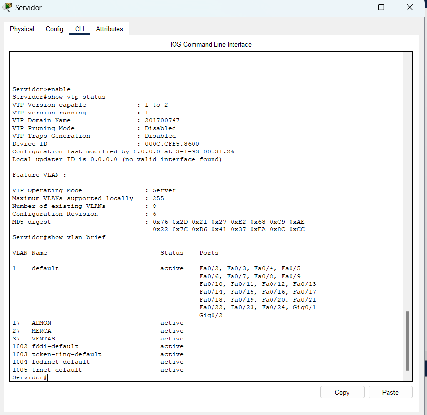
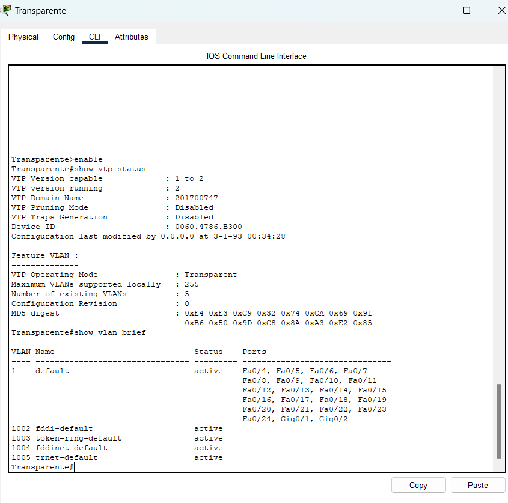
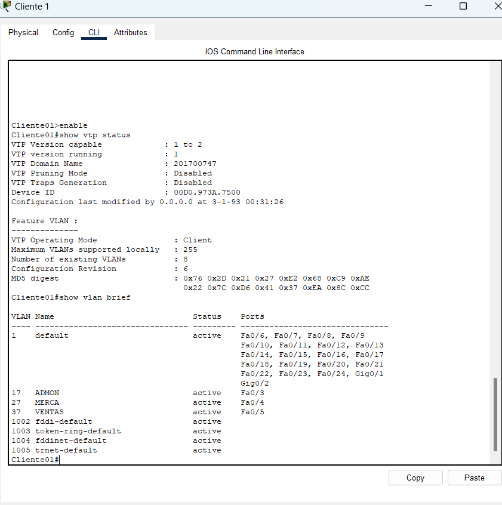
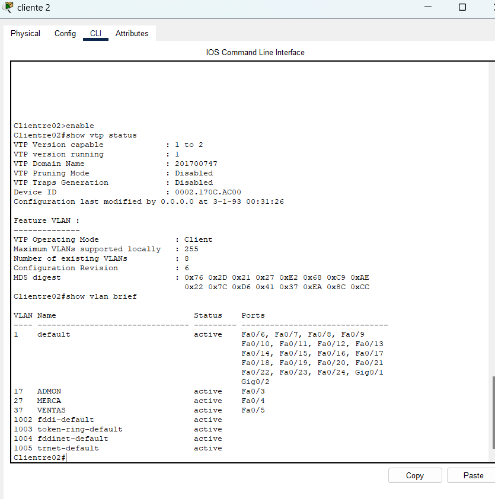
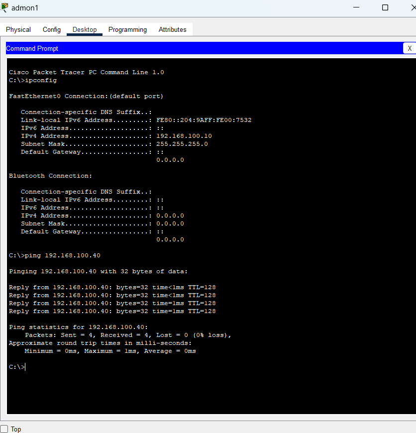
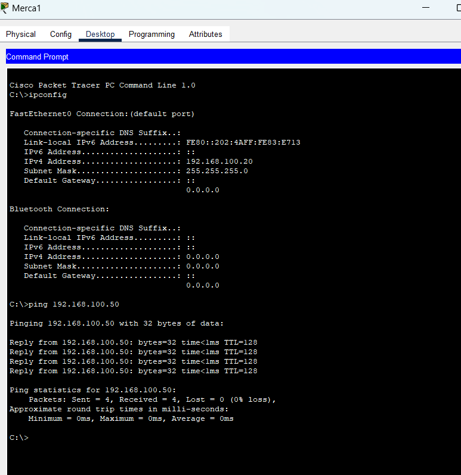
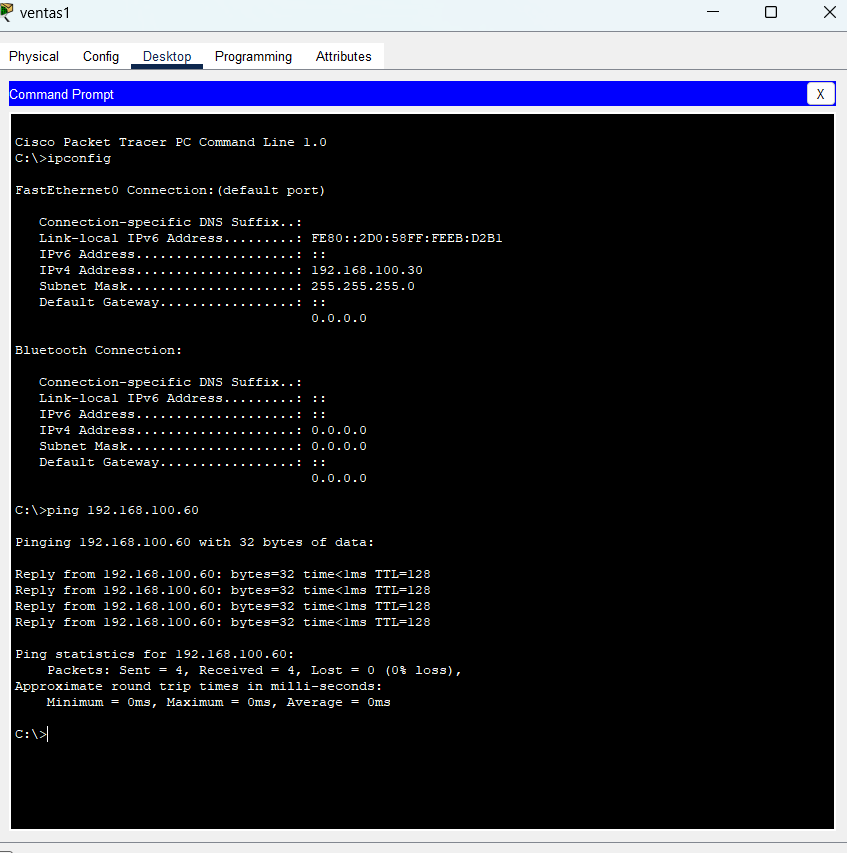
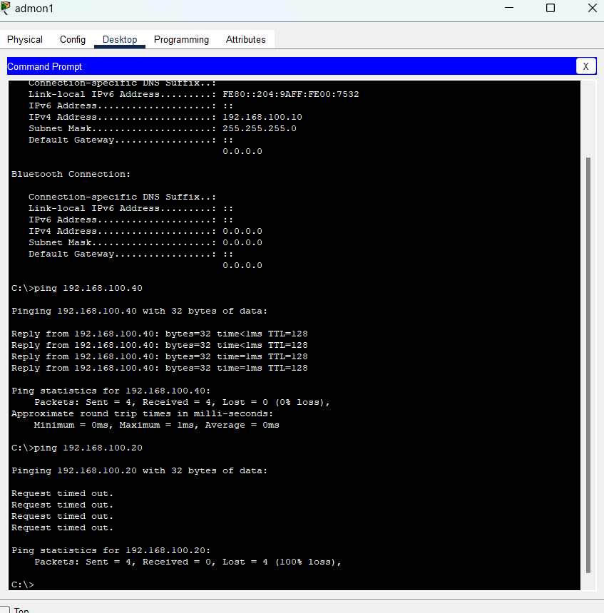
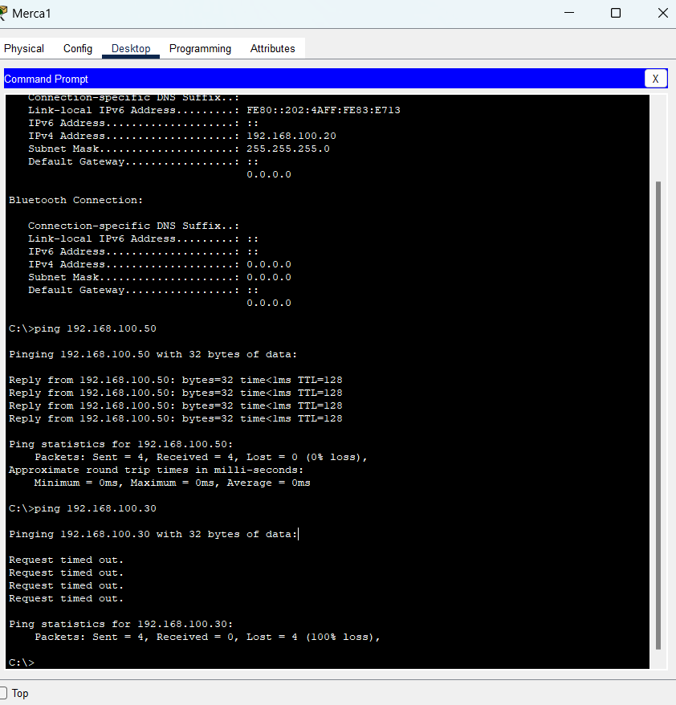
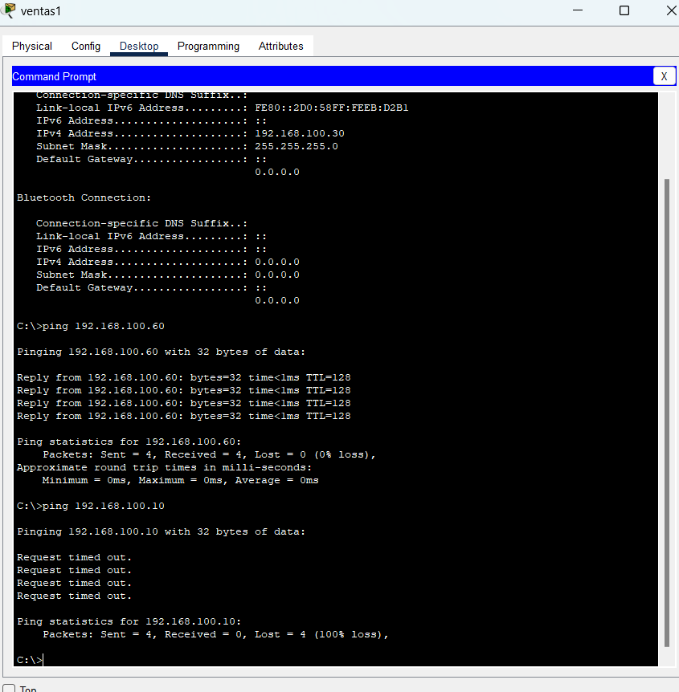

# Manual de Configuración - VTP y VLANs  

## Introducción  
Este manual documenta la configuración de una red que utiliza VTP y VLANs en switches Cisco y la asignación de PCs a las VLANs correspondientes.    
Número de carnet: **201700747**  

VLANs:  
- **VLAN17** → ADMON  
- **VLAN27** → MERCA  
- **VLAN37** → VENTAS  

Dispositivos:  
- Switch Servidor (VTP Server)  
- Switch Transparente (VTP Transparent)  
- Switch Cliente01 (VTP Client)  
- Switch Cliente02 (VTP Client)  
- PCs asignadas a las VLANs  

## Capturas mostrando las vlans de cada switch (show vlan brief). 
  
  
  
  

## Capturas mostrando las vlans de cada switch (show vtp status).
  
  
  
  

## Capturas de PC (una de cada VLAN) haciendo ping con misma VLAN y entre distinta VLAN 
  
  
 

  
  



## Configuración de Switches y Asignación de VLANs  

```plaintext  
! Switch Servidor  
enable  
configure terminal  
hostname Servidor  
vtp mode server  
vtp version 2  
vtp domain 201700747  
vtp password 201700747  

vlan 17  
 name ADMON  
 exit  
vlan 27  
 name MERCA  
 exit  
vlan 37  
 name VENTAS  
 exit  

interface FastEthernet 0/1  
 switchport mode trunk  
 exit  
interface FastEthernet 0/2  
 switchport mode trunk  
 exit  

! Switch Transparente  
enable  
configure terminal  
hostname Transparente  
vtp mode transparent  
vtp version 2  
vtp domain 201700747  
vtp password 201700747  

interface FastEthernet 0/1  
 switchport mode trunk  
 exit  
interface FastEthernet 0/2  
 switchport mode trunk  
 exit  
interface FastEthernet 0/3  
 switchport mode trunk  
 exit  

! Switch Cliente01  
enable  
configure terminal  
hostname Cliente01  
vtp mode client  
vtp version 2  
vtp domain 201700747  
vtp password 201700747  

interface FastEthernet 0/1  
 switchport mode trunk  
 exit  
interface FastEthernet 0/2  
 switchport mode trunk  
 exit  
interface FastEthernet 0/3  
 switchport mode access  
 switchport access vlan 17  
 exit  
interface FastEthernet 0/4  
 switchport mode access  
 switchport access vlan 27  
 exit  
interface FastEthernet 0/5  
 switchport mode access  
 switchport access vlan 37  
 exit  

! Switch Cliente02  
enable  
configure terminal  
hostname Cliente02  
vtp mode client  
vtp version 2  
vtp domain 201700747  
vtp password 201700747  

interface FastEthernet 0/1  
 switchport mode trunk  
 exit  
interface FastEthernet 0/2  
 switchport mode trunk  
 exit  
interface FastEthernet 0/3  
 switchport mode access  
 switchport access vlan 17  
 exit  
interface FastEthernet 0/4  
 switchport mode access  
 switchport access vlan 27  
 exit  
interface FastEthernet 0/5  
 switchport mode access  
 switchport access vlan 37  
 exit  