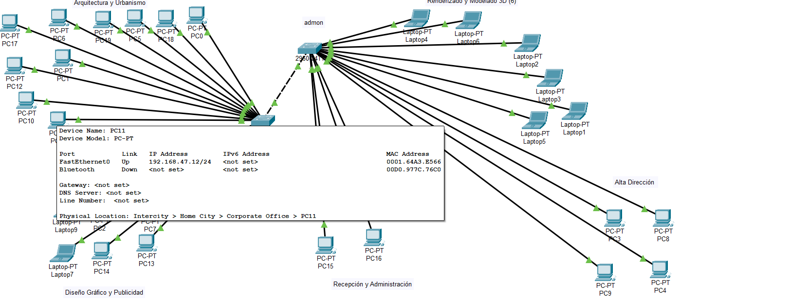
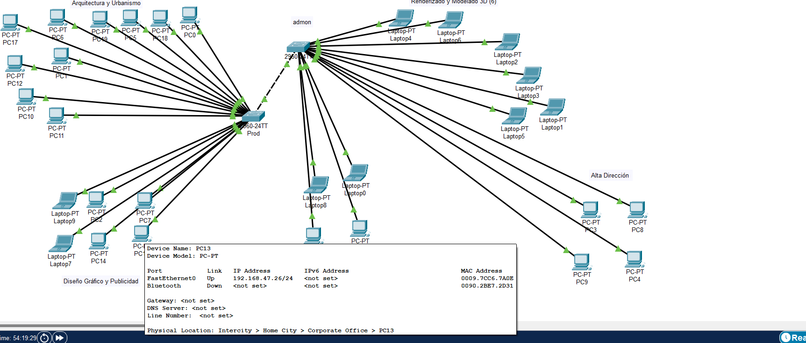
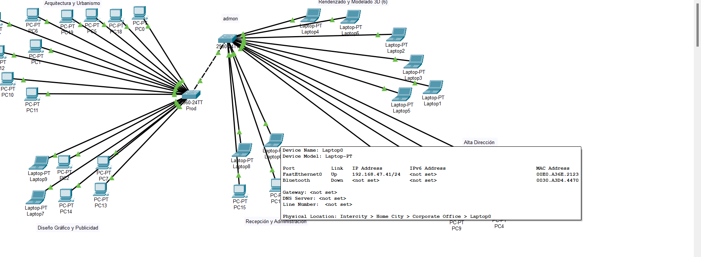
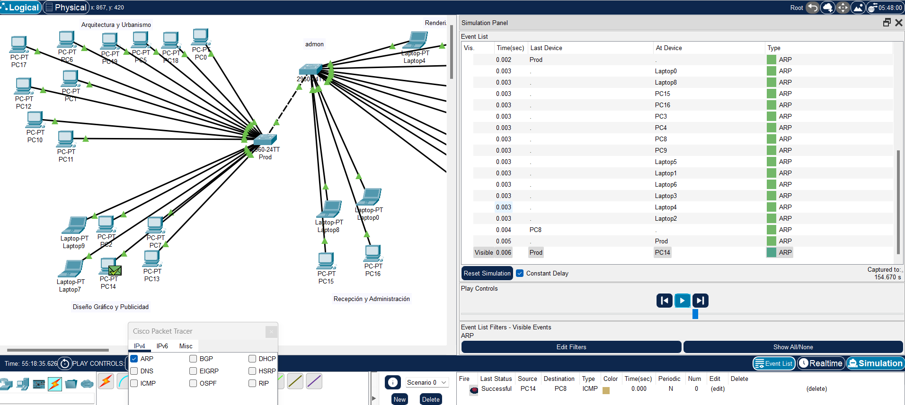
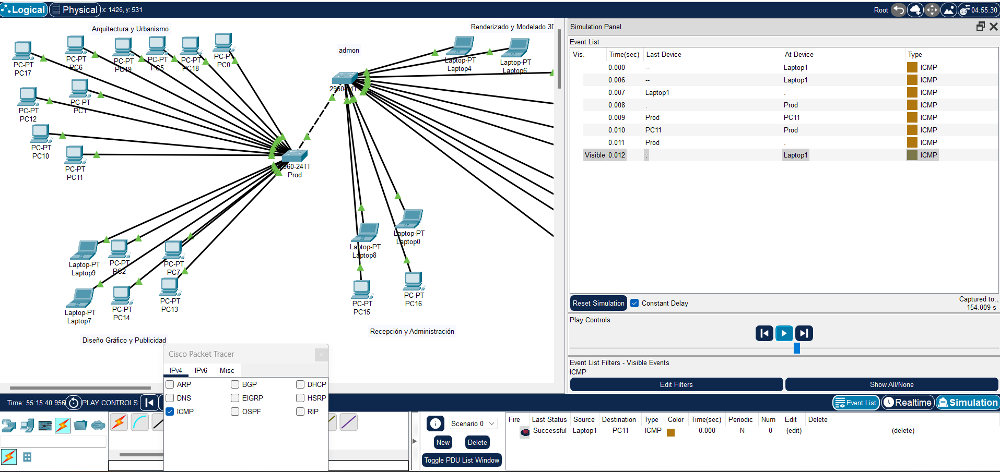

# Documentación de Configuración de Red  

## ● Una tabla con el detalle de todas las IP utilizadas.  

| Dispositivo  | Departamento                        | Dirección IP     | Máscara         |  
|--------------|-------------------------------------|------------------|-----------------|  
| PC1          | Arquitectura y Urbanismo            | 192.168.47.11    | 255.255.255.0   |  
| PC11         | Arquitectura y Urbanismo            | 192.168.47.12    | 255.255.255.0   |  
| PC5          | Arquitectura y Urbanismo            | 192.168.47.13    | 255.255.255.0   |  
| PC1          | Arquitectura y Urbanismo            | 192.168.47.14    | 255.255.255.0   |  
| PC12         | Arquitectura y Urbanismo            | 192.168.47.15    | 255.255.255.0   |  
| PC10         | Arquitectura y Urbanismo            | 192.168.47.16    | 255.255.255.0   |  
| PC18         | Arquitectura y Urbanismo            | 192.168.47.17    | 255.255.255.0   |  
| PC19         | Arquitectura y Urbanismo            | 192.168.47.18    | 255.255.255.0   |  
| PC6          | Arquitectura y Urbanismo            | 192.168.47.19    | 255.255.255.0   |  
| PC17         | Arquitectura y Urbanismo            | 192.168.47.20    | 255.255.255.0   |  
| LAPTOP9      | Diseño Gráfico y Publicidad         | 192.168.47.21    | 255.255.255.0   |  
| LAPTOP7      | Diseño Gráfico y Publicidad         | 192.168.47.22    | 255.255.255.0   |  
| PC2          | Diseño Gráfico y Publicidad         | 192.168.47.23    | 255.255.255.0   |  
| PC14         | Diseño Gráfico y Publicidad         | 192.168.47.24    | 255.255.255.0   |  
| PC7          | Diseño Gráfico y Publicidad         | 192.168.47.25    | 255.255.255.0   |  
| PC13         | Diseño Gráfico y Publicidad         | 192.168.47.26    | 255.255.255.0   |  
| LAPTOP4      | Renderizado y Modelado 3D           | 192.168.47.31    | 255.255.255.0   |  
| LAPTOP2      | Renderizado y Modelado 3D           | 192.168.47.32    | 255.255.255.0   |  
| LAPTOP6      | Renderizado y Modelado 3D           | 192.168.47.33    | 255.255.255.0   |  
| LAPTOP3      | Renderizado y Modelado 3D           | 192.168.47.34    | 255.255.255.0   |  
| LAPTOP5      | Renderizado y Modelado 3D           | 192.168.47.35    | 255.255.255.0   |  
| LAPTOP1      | Renderizado y Modelado 3D           | 192.168.47.36    | 255.255.255.0   |  
| LAPTOP0      | Recepción y Administración           | 192.168.47.41    | 255.255.255.0   |  
| LAPTOP8      | Recepción y Administración           | 192.168.47.42    | 255.255.255.0   |  
| PC15         | Recepción y Administración           | 192.168.47.43    | 255.255.255.0   |  
| PC16         | Recepción y Administración           | 192.168.47.44    | 255.255.255.0   |  
| PC3          | Alta Dirección                       | 192.168.47.51    | 255.255.255.0   |  
| PC8          | Alta Dirección                       | 192.168.47.52    | 255.255.255.0   |  
| PC9          | Alta Dirección                       | 192.168.47.53    | 255.255.255.0   |  
| PC4          | Alta Dirección                       | 192.168.47.54    | 255.255.255.0   |  

## ● Capturas de la configuración de las VPCs (una por cada área) en total 5.  

  
  
  
  
  

## ● Capturas de pantalla de pings entre hosts (Comunicación entre áreas, solo 5 en total).  

%20a%20PC3%20(Alta%20Dirección).png)  
%20a%20LAPTOP9%20(Diseño%20Gráfico%20y%20Publicidad).png)  
%20a%20PC1%20(Arquitectura%20y%20Urbanismo).png)  
%20a%20LAPTOP2%20(Renderizado%20y%20Modelado%203D).png)  
%20a%20PC16%20(Recepción%20y%20Administración).png)  

## ● Captura de pantalla de la demostración de la captura de un paquete ARP y un ICMP en el modo Simulación.  

  


## ● Los comandos utilizados para configurar los switches.  

```bash  
enable  
configure terminal  
ip domain-lookup  
hostname prod  
enable secret mami2441  # contraseña de terminal  
show running-config  
line console 0  
password consola        # contraseña para consola  
login  
end  
exit  
write system  
banner motd #Hola listo para calificacion#  # mensaje de bienvenida  
enable  
configure terminal  
ip domain-lookup  
hostname admon  
enable secret mami2441  # contraseña de terminal  
show running-config  
line console 0  
password consola        # contraseña para consola  
login  
end  
exit  
write system  
banner motd #Soy mejor que el otro switch#  # mensaje de bienvenida  

