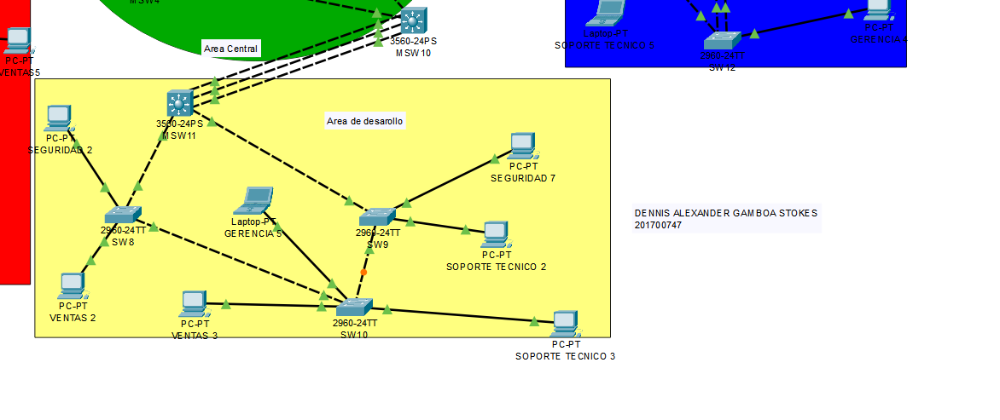

# Tablas  

## Tabla de VLAN  
| **Departamento** | **VLAN** | **ID de red**        |  
|------------------|:-------:|----------------------|  
| Ventas           |   17    | 192.168.17.0/24      |  
| Soporte          |   27    | 192.168.27.0/24      |  
| Gerencia         |   37    | 192.168.37.0/24      |  
| Seguridad        |   47    | 192.168.47.0/24      |  

## Tabla de IP  
| **Computadora**           | **Área**                | **Dirección IP**  |  
|---------------------------|-------------------------|-------------------|  
| **VENTAS**               |                         |                   |  
| PC-PT VENTAS 1           | Área de Administración  | 192.168.17.1      |  
| PC-PT VENTAS 2           | Área de Desarrollo      | 192.168.17.2      |  
| PC-PT VENTAS 3           | Área de Desarrollo      | 192.168.17.3      |  
| PC-PT VENTAS 4           | Área de Infraestructura | 192.168.17.4      |  
| PC-PT VENTAS 5           | Área de Administración  | 192.168.17.5      |  
| **SOPORTE TÉCNICO**      |                         |                   |  
| PC-PT SOPORTE TECNICO 1  | Área de Administración  | 192.168.27.1      |  
| PC-PT SOPORTE TECNICO 2  | Área de Desarrollo      | 192.168.27.2      |  
| PC-PT SOPORTE TECNICO 3  | Área de Desarrollo      | 192.168.27.3      |  
| PC-PT SOPORTE TECNICO 4  | Área de Infraestructura | 192.168.27.4      |  
| Laptop-PT SOPORTE TECNICO 5 | Área de Gerencia     | 192.168.27.5      |  
| **GERENCIA**             |                         |                   |  
| PC-PT GERENCIA 1         | Área de Administración  | 192.168.37.1      |  
| PC-PT GERENCIA 2         | Área de Administration  | 192.168.37.2      |  
| PC-PT GERENCIA 3         | Área de Gerencia        | 192.168.37.3      |  
| PC-PT GERENCIA 4         | Área de Gerencia        | 192.168.37.4      |  
| Laptop-PT GERENCIA 5     | Área de Desarrollo      | 192.168.37.5      |  
| **SEGURIDAD**            |                         |                   |  
| PC-PT SEGURIDAD 1        | Área de Administración  | 192.168.47.1      |  
| PC-PT SEGURIDAD 2        | Área de Desarrollo      | 192.168.47.2      |  
| Laptop-PT SEGURIDAD 3    | Área de Gerencia        | 192.168.47.3      |  
| Laptop-PT SEGURIDAD 5    | Área de Infraestructura | 192.168.47.5      |  
| Laptop-PT SEGURIDAD 6    | Área de Infraestructura | 192.168.47.6      |  
| PC-PT SEGURIDAD 7        | Área de Desarrollo      | 192.168.47.7      |  
| **RECEPCIÓN**            |                         |                   |  
| PC-PT RECEPCION 1        | Recepción               | 192.168.57.1      |  
| PC-PT RECEPCION 2        | Recepción               | 192.168.57.2      |  
| PC-PT RECEPCION 3        | Recepción               | 192.168.57.3      |  
| PC-PT RECEPCION 4        | Recepción               | 192.168.57.4      |  

---  

# Topología  

A continuación, sección para seis imágenes de la topología. Reemplaza los nombres de archivo por los de tus imágenes:  
1.  
2.   
3.   
4.   
5.   
6.   
 

---  

# Comandos Usados  

```plaintext  
COMANDOS USADOS  
-----------------------------------------------------------------  
SWITCH SERVIDOR  
-------------------------------------------------------------------  
enable  
configure terminal  

vtp mode server  
vtp domain G0_technet  
vtp password secure2025  
vtp version 2  

vlan 17  
 name VENTAS  
exit  
vlan 27  
 name SOPORTE  
exit  
vlan 37  
 name GERENCIA   
exit  
vlan 47  
 name SEGURIDAD  
exit  

----------------------------------------------------------  
switch clients  
---------------------------------------------------  
enable  
configure terminal  

vtp mode client  
vtp domain G0_technet  
vtp password secure2025  
vtp version 2  
do write  

exit  

show vtp status  

-----------------------------------------------  
switch transparate /recepcion  
---------------------------------------------  
enable  
configure terminal  

vtp mode transparent  
vtp domain G0_technet  
vtp password secure2025  
vtp version 2  
do write  

exit  

show vtp status  

--------------------------------------------------------  
trunks configuration  
--------------------------------------------------------  
SWITCH SERVER/  
----------------------------------------------  
enable  
configure terminal  
interface range FastEthernet0/1-4  
switchport trunk encapsulation dot1q  
switchport mode trunk  
switchport trunk allowed vlan all  
do write  

exit  

show interface trunk  

-------------------------------------  
switch MSW1/MSW4  
----------------------------------------  
enable  
configure terminal  
interface range FastEthernet0/1-6  
switchport trunk encapsulation dot1q  
switchport mode trunk  
switchport trunk allowed vlan all  
do write  

exit  

show interface trunk  

---------------------------------------  
MSW2/MSW3  
---------------------------------------  
enable  
configure terminal  
interface range FastEthernet0/1-5  
switchport trunk encapsulation dot1q  
switchport mode trunk  
switchport trunk allowed vlan all  
do write  

exit  

show interface trunk  

--------------------------------------------------  
MSW9/MSW10  
--------------------------------------------------  
enable  
configure terminal  
interface range FastEthernet0/2-6  
switchport trunk encapsulation dot1q  
switchport mode trunk  
switchport trunk allowed vlan all  
do write  

exit  

show interface trunk  

-------------------------------------------  
MSW5/7  
----------------------------------------------  
enable  
configure terminal  
interface range FastEthernet0/1-4  
switchport trunk encapsulation dot1q  
switchport mode trunk  
switchport trunk allowed vlan all  
do write  

exit  

show interface trunk  

-------------------------------------  
MSW6  
-----------------------------------  
enable  
configure terminal  
interface range FastEthernet0/1-6  
switchport trunk encapsulation dot1q  
switchport mode trunk  
switchport trunk allowed vlan all  
do write  

exit  

show interface trunk  

-------------------------------------  
MSW8/11  
-------------------------------------  
enable  
configure terminal  
interface range FastEthernet0/1-5  
switchport trunk encapsulation dot1q  
switchport mode trunk  
switchport trunk allowed vlan all  
do write  

exit  

show interface trunk  

-------------------------------------------  
JUST TRUNK SWITCH SW0  
------------------------------------------  
enable  
configure terminal  
interface range FastEthernet0/1-5  
switchport mode trunk  
switchport trunk allowed vlan all  
do write  

exit  

show interface trunk  

----------------------------------------------  
SW1  
-----------------------------------------------  
enable  
configure terminal  
interface  FastEthernet0/1  
switchport mode trunk  
switchport trunk allowed vlan all  
do write  

exit  

interface FastEthernet0/2  
switchport mode access  
switchport access vlan 17  
exit  

interface FastEthernet0/3  
switchport mode access  
switchport access vlan 37  
exit  

show interface trunk  

---------------------------------------------------  
SW2  
----------------------------------------------------  
enable  
configure terminal  
interface  FastEthernet0/1  
switchport mode trunk  
switchport trunk allowed vlan all  
do write  

exit  

interface FastEthernet0/2  
switchport mode access  
switchport access vlan 47  
exit  

show interface trunk  

---------------------------------------------------  
SW3  
----------------------------------------------------  
enable  
configure terminal  
interface  FastEthernet0/1  
switchport mode trunk  
switchport trunk allowed vlan all  
do write  

exit  

interface FastEthernet0/2  
switchport mode access  
switchport access vlan 27  
exit  

show interface trunk  

---------------------------------------------------  
SW4  
----------------------------------------------------  
enable  
configure terminal  
interface  FastEthernet0/1  
switchport mode trunk  
switchport trunk allowed vlan all  
do write  

exit  

interface FastEthernet0/2  
switchport mode access  
switchport access vlan 37  
exit  

interface FastEthernet0/3  
switchport mode access  
switchport access vlan 17  
exit  

show interface trunk  

---------------------------------------------------  
SW5-RECEPCION VLAN 57  
----------------------------------------------------  
enable  
configure terminal  
interface range FastEthernet0/2-5  
switchport mode access  
switchport access vlan 57  
exit  

show interface trunk  

---------------------------------------------------  
SW8  
----------------------------------------------------  
enable  
configure terminal  
interface range FastEthernet0/1-2  
switchport mode trunk  
switchport trunk allowed vlan all  
do write  

exit  

interface FastEthernet0/3  
switchport mode access  
switchport access vlan 47  
exit  

interface FastEthernet0/4  
switchport mode access  
switchport access vlan 17  
exit  

show interface trunk  
show vlan brief  

---------------------------------------------------  
SW10  
----------------------------------------------------  
enable  
configure terminal  
interface range FastEthernet0/1-2  
switchport mode trunk  
switchport trunk allowed vlan all  
do write  

exit  

interface FastEthernet0/3  
switchport mode access  
switchport access vlan 17  
exit  

interface FastEthernet0/4  
switchport mode access  
switchport access vlan 27  
exit  

interface FastEthernet0/5  
switchport mode access  
switchport access vlan 37  
exit  

show interface trunk  
show vlan brief  

---------------------------------------------------  
SW9  
----------------------------------------------------  
enable  
configure terminal  
interface range FastEthernet0/1-2  
switchport mode trunk  
switchport trunk allowed vlan all  
do write  

exit  

interface FastEthernet0/3  
switchport mode access  
switchport access vlan 27  
exit  

interface FastEthernet0/4  
switchport mode access  
switchport access vlan 47  
exit  

show interface trunk  
show vlan brief  

---------------------------------------------------  
SW11  
----------------------------------------------------  
enable  
configure terminal  
interface range FastEthernet0/1-4  
switchport mode trunk  
switchport trunk allowed vlan all  
do write  

exit  

interface FastEthernet0/5  
switchport mode access  
switchport access vlan 47  
exit  

interface FastEthernet0/6  
switchport mode access  
switchport access vlan 27  
exit  

show interface trunk  
show vlan brief  

---------------------------------------------------  
SW12/13  
----------------------------------------------------  
enable  
configure terminal  
interface range FastEthernet0/1-3  
switchport mode trunk  
switchport trunk allowed vlan all  
do write  

exit  

interface FastEthernet0/4  
switchport mode access  
switchport access vlan 37  
exit  

show interface trunk  
show vlan brief  

-----------------------------------------------------------  
SW7  
-----------------------------------------------------------  
enable  
configure terminal  
interface  FastEthernet0/1  
switchport mode trunk  
switchport trunk allowed vlan all  
do write  

exit  

interface FastEthernet0/2  
switchport mode access  
switchport access vlan 47  
exit  

interface FastEthernet0/3  
switchport mode access  
switchport access vlan 17  
exit  

show interface trunk  
show vlan brief  

--------------------------------------------------------------  
SW6  
---------------------------------------------------------------  
enable  
configure terminal  
interface  FastEthernet0/1  
switchport mode trunk  
switchport trunk allowed vlan all  
do write  

exit  

interface FastEthernet0/2  
switchport mode access  
switchport access vlan 27  
exit  

interface FastEthernet0/3  
switchport mode access  
switchport access vlan 47  
exit  

show interface trunk  
show vlan brief  

-----------------------------------------------------------  
PVST  
------------------------------------------------------------  
enable  
configure terminal  
spanning-tree mode pvst  
do w  
exit  

show spanning-tree  

---------------------------------------  
ROOT BRIDGE  
-----------------------------------------  
enable  
configure terminal  
spanning-tree vlan 17 root primary  
do w  
exit  

show spanning-tree  
exit  

enable  
configure terminal  
spanning-tree vlan 27 root primary  
do w  
exit  

show spanning-tree  
exit  

enable  
configure terminal  
spanning-tree vlan 37 root primary  
do w  
exit  

show spanning-tree  
exit  

enable  
configure terminal  
spanning-tree vlan 47 root primary  
do w  
exit  

show spanning-tree  
exit  

------------------------------------------------------------  
LACP  
--------------------------------------------------------------  
MSW8  
-------------------------------------------------------------  
enable  
configure terminal  
interface range fastEthernet 0/1-3  
switchport trunk encapsulation dot1q  
switchport mode trunk  
switchport trunk allowed vlan all  

channel-protocol lacp  
channel-group 1 mode active  
do w  
exit  

interface port-channel 1  
switchport trunk encapsulation dot1q  
switchport mode trunk  
switchport trunk allowed vlan all  
do w  
exit  

--------------------------------------------------------------  
MSW9  
--------------------------------------------------------------  
enable  
configure terminal  
interface range fastEthernet 0/2-4  
switchport trunk encapsulation dot1q  
switchport mode trunk  
switchport trunk allowed vlan all  

channel-protocol lacp  
channel-group 1 mode active  
do w  
exit  

interface port-channel 1  
switchport trunk encapsulation dot1q  
switchport mode trunk  
switchport trunk allowed vlan all  
do w  
exit  

------------------------------------------------------------  
PAgP  
-------------------------------------------------------------  
MSW10  
-------------------------------------------------------------  
enable  
configure terminal  
interface range fastEthernet 0/4-6  
switchport trunk encapsulation dot1q  
switchport mode trunk  
switchport trunk allowed vlan all  

channel-protocol pagp  
channel-group 1 mode auto  
do w  
exit  

interface port-channel 1  
switchport trunk encapsulation dot1q  
switchport mode trunk  
switchport trunk allowed vlan all  
exit  

------------------------------------------------------------  
MSW11  
-----------------------------------------------------------  
enable  
configure terminal  
interface range fastEthernet 0/1-3  
switchport trunk encapsulation dot1q  
switchport mode trunk  
switchport trunk allowed vlan all  

channel-protocol pagp  
channel-group 1 mode desirable  
do w  
exit  

interface port-channel 1  
switchport trunk encapsulation dot1q  
switchport mode trunk  
switchport trunk allowed vlan all  
exit  
```

---
# Ping entre Hosts  

Espacio para cuatro imágenes sobre los resultados de ping. Reemplaza los nombres con tus capturas:  

1.  
2. 
3.  
4.  

---  


