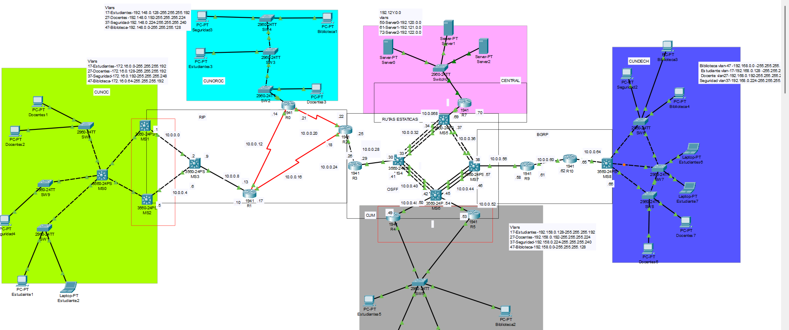
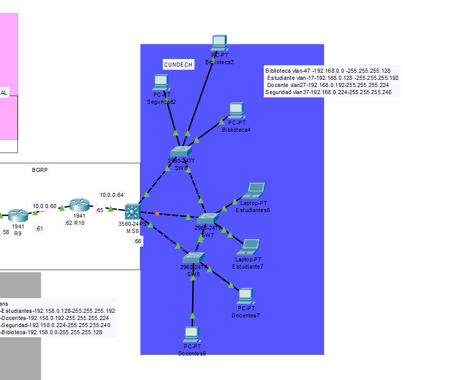
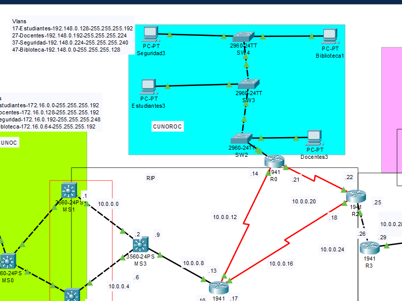
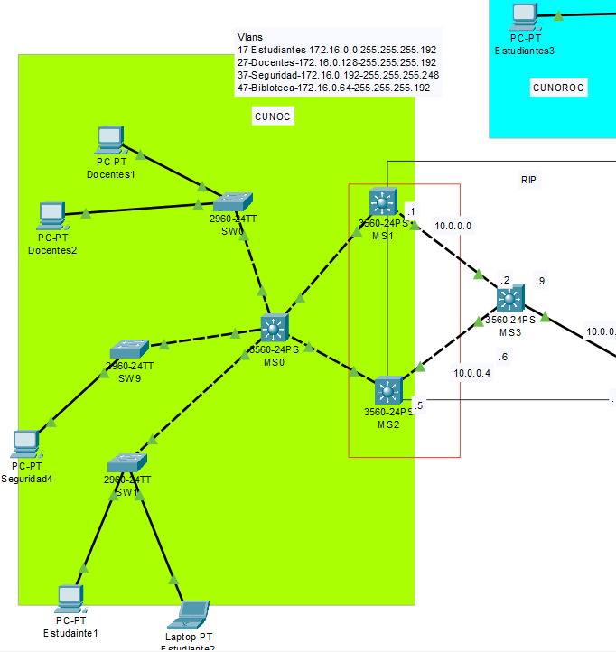
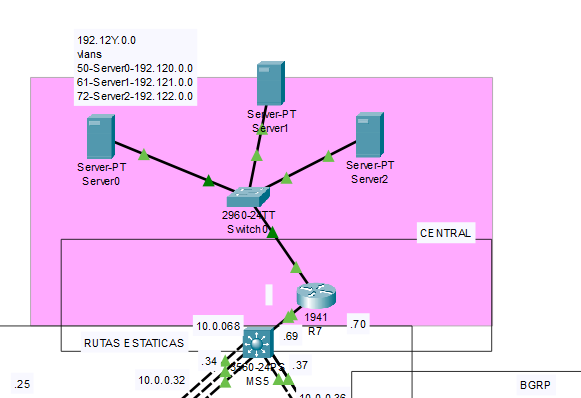
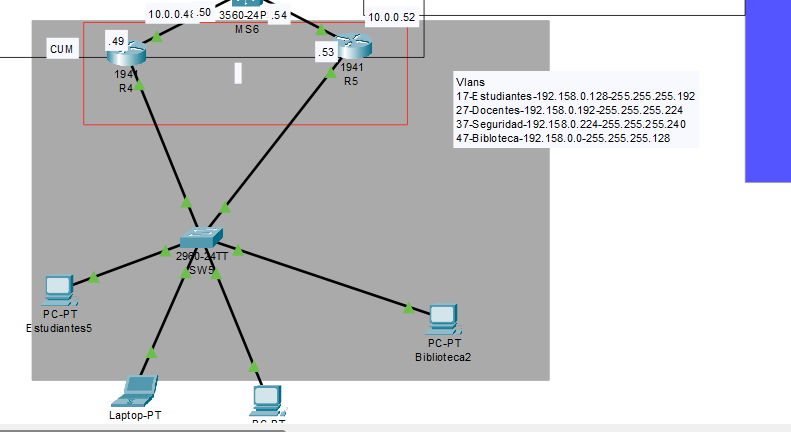
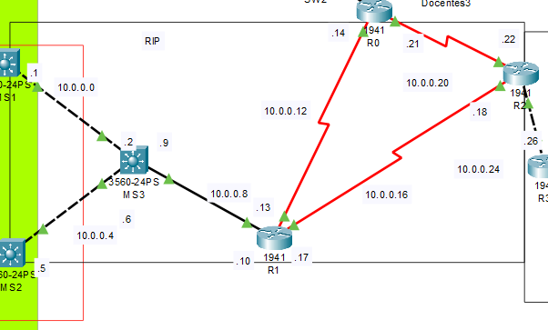
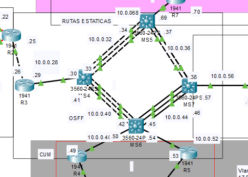
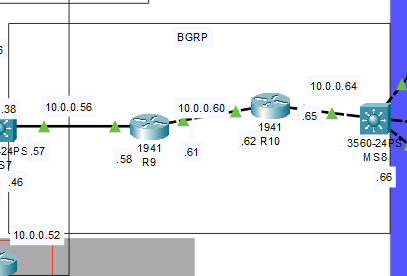

# Documentación del Proyecto de Redes

## Resumen del Proyecto
Este proyecto fue diseñado para interconectar varias sedes de la Universidad de San Carlos de Guatemala (USAC) mediante VLANs y protocolos de enrutamiento como OSPF y EIGRP. Se configuraron distintos dispositivos de red, incluyendo switches y routers, para garantizar la conectividad entre todos los puntos de la red.

### Justificación de las Máscaras  
Se utilizaron máscaras de subred que permiten un uso eficiente del espectro de direcciones IP disponible. Se aplicó VLSM (Variable Length Subnet Mask) para optimizar la asignación de direcciones en cada VLAN según el número de dispositivos requeridos. Este enfoque reduce el desperdicio de direcciones IP y mejora la organización del espacio de direcciones.  

---  

## SUBNETING

### **CUNDECH**
IP = 192.168.0.0/24
| Resumen |        |
|---------|--------|
| ID RED | 192.168.0.0|
| Mascara de Subred | 255.255.255.0|
| Wildcar | 0.0.0.255|
| Brodcast | 192.168.0.255|
| Primer Host | 192.168.0.1|
| Ultimo Host | 192.168.0.254|
| Numero de Host | 256|
| Host Utilizables | 254|

#### VLSM
|VLAN|Id Red|Mascara|Wildcard|Primer|Ultimo|Broadcast|Host Utilizables|Host Utilizado|Host desperdiciado|
|:--- | :---:| :---: | :---:  |:---: | :---:|  :---:  | :---:          |:---: | :---:|
|Biblioteca|192.168.0.0|255.255.255.128|0.0.0.127|192.168.0.1|192.168.0.126|192.168.0.127|126|100|26|
|Estudiantes|192.168.0.128|255.255.255.192|0.0.0.63|192.168.0.129|192.168.0.190|192.168.0.191|62|50|12|
|Docentes|192.168.0.192|255.255.255.224|0.0.0.31|192.168.0.193|192.168.0.222|192.168.0.223|30|20|10|
|Seguridad|192.168.0.224|255.255.255.248|0.0.0.7|192.168.0.225|192.168.0.230|192.168.0.231|6|5|1|

### **CUNOROC**
IP = 192.148.0.0/24
| Resumen |        |
|---------|--------|
| ID RED | 192.148.0.0|
| Mascara de Subred | 255.255.255.0|
| Wildcar | 0.0.0.255|
| Brodcast | 192.148.0.255|
| Primer Host | 192.148.0.1|
| Ultimo Host | 192.148.0.254|
| Numero de Host | 256|
| Host Utilizables | 254|

#### VLSM
|VLAN|Id Red|Mascara|Wildcard|Primer|Ultimo|Broadcast|Host Utilizables|Host Utilizado|Host desperdiciado|
|:--- | :---:| :---: | :---:  |:---: | :---:|  :---:  | :---:          |:---: | :---:|
|Biblioteca|192.148.0.0|255.255.255.128|0.0.0.127|192.148.0.1|192.148.0.126|192.148.0.127|126|75|51|
|Estudiantes|192.148.0.128|255.255.255.192|0.0.0.63|192.148.0.129|192.148.0.190|192.148.0.191|62|45|17|
|Docentes|192.148.0.192|255.255.255.224|0.0.0.31|192.148.0.193|192.148.0.222|192.148.0.223|30|25|5|
|Seguridad|192.148.0.224|255.255.255.240|0.0.0.15|192.148.0.225|192.148.0.238|192.148.0.239|14|10|4|

### **CUNOC**
IP = 172.16.0.0/24
| Resumen |        |
|---------|--------|
| ID RED | 172.16.0.0|
| Mascara de Subred | 255.255.255.0|
| Wildcar | 0.0.0.255|
| Brodcast | 172.16.0.255|
| Primer Host | 172.16.0.1|
| Ultimo Host | 172.16.0.254|
| Numero de Host | 256|
| Host Utilizables | 254|

#### VLSM
|VLAN|Id Red|Mascara|Wildcard|Primer|Ultimo|Broadcast|Host Utilizables|Host Utilizado|Host desperdiciado|
|:--- | :---:| :---: | :---:  |:---: | :---:|  :---:  | :---:          |:---: | :---:|
|Estudiantes|172.16.0.0|255.255.255.192|0.0.0.63|172.16.0.1|172.16.0.62|172.16.0.63|62|60|2|
|Docentes|172.16.0.128|255.255.255.192|0.0.0.63|172.16.0.129|172.16.0.190|172.16.0.191|62|35|27|
|Seguridad|172.16.0.192|255.255.255.248|0.0.0.7|172.16.0.193|172.16.0.198|172.16.0.199|6|5|1|
|Biblioteca|172.16.0.64|255.255.255.192|0.0.0.63|172.16.0.65|172.16.0.126|172.16.0.127|62|50|12|

### **CUM**
IP = 192.158.16.0/24
| Resumen |        |
|---------|--------|
| ID RED | 192.158.16.0|
| Mascara de Subred | 255.255.255.0|
| Wildcar | 0.0.0.255|
| Brodcast | 192.158.16.255|
| Primer Host | 192.158.16.1|
| Ultimo Host | 192.158.16.254|
| Numero de Host | 256|
| Host Utilizables | 254|

#### VLSM
|VLAN|Id Red|Mascara|Wildcard|Primer|Ultimo|Broadcast|Host Utilizables|Host Utilizado|Host desperdiciado|
|:--- | :---:| :---: | :---:  |:---: | :---:|  :---:  | :---:          |:---: | :---:|
|Estudiantes|192.158.0.128|255.255.255.192|0.0.0.63|192.158.0.129|192.158.0.190|192.158.0.191|62|55|7|
|Docentes|192.158.0.192|255.255.255.224|0.0.0.31|192.158.0.193|192.158.0.222|192.158.0.223|30|20|10|
|Seguridad|192.158.0.224|255.255.255.240|0.0.0.15|192.158.0.225|192.158.0.230|192.158.0.231|6|5|1|
|Biblioteca|192.158.0.0|255.255.255.128|0.0.0.127|192.158.0.1|192.158.0.126|192.158.0.127|126|110|16|

### **CENTRAL**
IP = 192.120.0.0/24
| Resumen |        |
|---------|--------|
| ID RED | 192.120.0.0|
| Mascara de Subred | 255.255.255.0|
| Wildcar | 0.0.0.255|
| Brodcast | 192.120.0.255|
| Primer Host | 192.120.0.1|
| Ultimo Host | 192.120.0.254|
| Numero de Host | 256|
| Host Utilizables | 254|

#### VLSM
|VLAN|Id Red|Mascara|Wildcard|Primer|Ultimo|Broadcast|Host Utilizables|Host Utilizado|Host desperdiciado|
|:--- | :---:| :---: | :---:  |:---: | :---:|  :---:  | :---:          |:---: | :---:|
|Server0|192.120.0.0|255.255.255.192|0.0.0.63|192.120.0.1|192.120.0.62|192.120.0.63|62|50|12|
|Server1|192.121.0.0|255.255.255.192|0.0.0.63|192.121.0.1|192.121.0.62|192.121.0.63|62|30|32|
|Server2|192.122.0.0|255.255.255.240|0.0.0.15|192.122.0.1|192.122.0.6|192.122.0.7|6|5|1|

---


## TOPOLOGIA
### Topologia Completa

### CUNDECH

### CUNOROC

### CUNOC

### CENTRAL

### CUM

### CORE/BACKBONE

#### Protocolo RIP

#### Protocolo OSPF

#### Protocolo EIGRP


## Configuración de Dispositivos

```bash  
# MS8 - Switch  
interface vlan 17    
 ip address 192.168.0.129 255.255.255.192   
 no shutdown   
 exit  

interface vlan 27    
 ip address 192.168.0.193 255.255.255.224   
 no shutdown   
 exit  

interface vlan 37    
 ip address 192.168.0.225 255.255.255.248   
 no shutdown   
 exit  

interface vlan 47    
 ip address 192.168.0.1 255.255.255.128  
 no shutdown   
 exit  

interface fa0/1  
 no switchport  
 ip address 10.0.0.66 255.255.255.252  
 no shutdown  
 exit  

ip routing  
router eigrp 100  
 network 10.0.0.64 0.0.0.3  
 network 192.168.0.0 0.0.0.63  
 network 192.168.0.128 0.0.0.31  
 network 192.168.0.192 0.0.0.7  
 network 192.168.0.224 0.0.0.127  

 no auto-summary  
 do w  
 exit  

# SW7 - Switch  
Switch>en  
Switch#conf t  
Switch(config)#hostname SW7  
SW7(config)#vtp domain Grupo0  
SW7(config)#vtp mode server  
SW7(config)#vtp password usac2025  
SW7(config)#vlan 17   
SW7(config-vlan)#name ESTUDIANTES  
SW7(config-vlan)#exit  
SW7(config)#vlan 27  
SW7(config-vlan)#name DOCENTES  
SW7(config-vlan)#exit  
SW7(config)#vlan 37  
SW7(config-vlan)#name SEGURIDAD  
SW7(config-vlan)#exit  
SW7(config)#vlan 47  
SW7(config-vlan)#name BIBLIOTECA   
SW7(config-vlan)#exit  
SW7(config)#interface range fa0/1-3  
SW7(config-if-range)#switchport mode trunk  
SW7(config-if-range)#do w  
SW7(config-if-range)#exit  
SW7(config)#interface range fa0/4-5  
SW7(config-if-range)#exit  
SW7(config)#interface range fa0/1-3  
SW7(config-if-range)#switchport mode trunk  
SW7(config-if-range)#switchport nonegotiate  
SW7(config-if-range)#do w  
SW7(config-if-range)#exit  
SW7(config)#interface range fa0/4-5  
SW7(config-if-range)#switchport mode access  
SW7(config-if-range)#switchport access vlan 17  
SW7(config-if-range)#spanning-tree portfast  
SW7(config-if-range)#do w  
SW7(config-if-range)#exit  
SW7(config)#end  
SW7#  
%SYS-5-CONFIG_I: Configured from console by console  
SW7#exit  

# SW8 - Switch  
en   
conf t  
vtp domain Grupo0  
vtp mode client  
vtp password usac2025  

# SW0 - Switch  
en  
conf t  
hostname SW0  
vtp version 2  
vtp domain Grupo0   
vtp mode client  
vtp password usac2025  
interface fa0/1       
 switchport mode trunk   
 switchport trunk allowed vlan all  
 do w  
 exit  
interface fa0/2        
 switchport mode access  
 switchport access vlan 27  
 do w  
 exit  
interface fa0/3         
 switchport mode access  
 switchport access vlan 27  
 do w  
 exit  
exit  

# SW9 - Switch  
en  
conf t  
hostname SW9  
vtp domain Grupo0  
vtp mode client  
vtp password usac2025  
interface fa0/1         
 switchport mode trunk  
 switchport nonegotiate  
 do w  
exit  
interface fa0/2         
 switchport mode access  
 switchport access vlan 37  
 spanning-tree portfast  
 do w  
exit  

# SW1 - Switch  
en  
conf t  
hostname SW1  
vtp domain Grupo0     
vtp mode client  
vtp password usac2025  
interface fa0/1         
 switchport mode trunk  
 switchport nonegotiate  
do w  
exit  
interface fa0/2         
 switchport mode access  
 switchport access vlan 17  
 spanning-tree portfast  
do w  
exit  
interface fa0/3        
 switchport mode access  
 switchport access vlan 17  
 spanning-tree portfast  
do w  
exit  
exit  
exit  

# SW3 - Switch  
Switch>en  
Switch#conf t  
Enter configuration commands, one per line.  End with CNTL/Z.  
Switch(config)#hostname SW3  
SW3(config)#vtp domain Grupo0  
Changing VTP domain name from NULL to Grupo0  
SW3(config)#vtp mode server  
Device mode already VTP SERVER.  
SW3(config)#vtp password usac2025  
Setting device VLAN database password to usac2025  
SW3(config)#vlan 17   
SW3(config-vlan)#name ESTUDIANTES  
SW3(config-vlan)#exit  
SW3(config)#vlan 27   
SW3(config-vlan)#name DOCENTES  
SW3(config-vlan)#exit  
SW3(config)#vlan 37   
SW3(config-vlan)#name SEGURIDAD  
SW3(config-vlan)#exit  
SW3(config)#vlan 47   
SW3(config-vlan)#name BIBLIOTECA  
SW3(config-vlan)#exit  
SW3(config)#do w  
Building configuration...  
[OK]  
SW3(config)#interface Fa0/1  
SW3(config-if)#switchport mode trunk  
SW3(config-if)#switchport nonegotiate  
%LINEPROTO-5-UPDOWN: Line protocol on Interface FastEthernet0/1, changed state to down  
%LINEPROTO-5-UPDOWN: Line protocol on Interface FastEthernet0/1, changed state to up  
SW3(config-if)#do w  
Building configuration...  
[OK]  
SW3(config-if)#exit  
SW3(config)#interface Fa0/2  
SW3(config-if)#switchport mode trunk  
SW3(config-if)#switchport nonegotiate  
%LINEPROTO-5-UPDOWN: Line protocol on Interface FastEthernet0/2, changed state to down  
%LINEPROTO-5-UPDOWN: Line protocol on Interface FastEthernet0/2, changed state to up  
SW3(config-if)#do w  
Building configuration...  
[OK]  
SW3(config-if)#exit  
SW3(config)#interface Fa0/3  
SW3(config-if)#switchport mode access  
SW3(config-if)#switchport access vlan 17  
SW3(config-if)#spanning-tree portfast  
%Warning: portfast should only be enabled on ports connected to a single host. Connecting hubs, concentrators, switches, bridges, etc... to this interface  when portfast is enabled, can cause temporary bridging loops.  
Use with CAUTION  
%Portfast has been configured on FastEthernet0/3 but will only have effect when the interface is in a non-trunking mode.  
SW3(config-if)#do w  
SW3(config-if)#exit  

# SW2 - Switch  
Switch>en  
Switch#conf t  
Enter configuration commands, one per line.  End with CNTL/Z.  
Switch(config)#hostname SW2  
SW2(config)#vtp domain Grupo0  
Changing VTP domain name from NULL to Grupo0  
SW2(config)#vtp mode client  
Setting device to VTP CLIENT mode.  
SW2(config)#vtp password usac2025  
Setting device VLAN database password to usac2025  
SW2(config)#interface Fa0/1  
SW2(config-if)#switchport mode trunk  
SW2(config-if)#switchport nonegotiate  
SW2(config-if)#do w  
Building configuration...  
[OK]  
SW2(config-if)#exit  
SW2(config)#interface Fa0/2  
SW2(config-if)#switchport mode trunk  
SW2(config-if)#switchport nonegotiate  
SW2(config-if)#  
%LINEPROTO-5-UPDOWN: Line protocol on Interface FastEthernet0/2, changed state to down  
%LINEPROTO-5-UPDOWN: Line protocol on Interface FastEthernet0/2, changed state to up  
SW2(config-if)#do w  
Building configuration...  
[OK]  
SW2(config-if)#exit  
SW2(config)#interface Fa0/3  
SW2(config-if)#switchport mode access  
SW2(config-if)#switchport access vlan 27  
SW2(config-if)#spanning-tree portfast  
%Warning: portfast should only be enabled on ports connected to a single host. Connecting hubs, concentrators, switches, bridges, etc... to this interface  when portfast is enabled, can cause temporary bridging loops.  
Use with CAUTION  
SW2(config-if)#do w  
Building configuration...  
[OK]  
SW2(config-if)#exit  
SW2(config)#exit  

# SW4 - Switch  
Switch>en  
Switch#conf t  
Enter configuration commands, one per line.  End with CNTL/Z.  
Switch(config)#hostname SW4  
SW4(config)#vtp domain Grupo0  
Changing VTP domain name from NULL to Grupo0  
SW4(config)#vtp mode client  
Setting device to VTP CLIENT mode.  
SW4(config)#vtp password usac2025  
Setting device VLAN database password to usac2025  
SW4(config)#interface Fa0/1  
SW4(config-if)#switchport mode trunk  
SW4(config-if)#switchport nonegotiate  
%LINEPROTO-5-UPDOWN: Line protocol on Interface FastEthernet0/1, changed state to down  
%LINEPROTO-5-UPDOWN: Line protocol on Interface FastEthernet0/1, changed state to up  
SW4(config-if)#do w  
Building configuration...  
[OK]  
SW4(config-if)#exit  
SW4(config)#interface Fa0/2  
SW4(config-if)#switchport mode access  
SW4(config-if)#switchport access vlan 47  
SW4(config-if)#spanning-tree portfast  
%Warning: portfast should only be enabled on ports connected to a single host. Connecting hubs, concentrators, switches, bridges, etc... to this interface  when portfast is enabled, can cause temporary bridging loops.  
Use with CAUTION  
SW4(config-if)#do w  
Building configuration...  
[OK]  
SW4(config-if)#exit  
SW4(config)#interface Fa0/3  
SW4(config-if)#switchport mode access  
SW4(config-if)#switchport access vlan 37  
SW4(config-if)#spanning-tree portfast  
%Warning: portfast should only be enabled on ports connected to a single host. Connecting hubs, concentrators, switches, bridges, etc... to this interface  when portfast is enabled, can cause temporary bridging loops.  
Use with CAUTION  
SW4(config-if)#do w  
Building configuration...  
[OK]  
SW4(config-if)#exit  
SW4(config)#exit  

# R0 - Router  
enable  
configure terminal  
interface gi0/0  
no shutdown  
exit   

interface Gig0/0.17  
encapsulation dot1q 17  
ip address 192.148.0.129 255.255.255.192    
exit  

interface Gig0/0.27  
encapsulation dot1q 27  
ip address 192.148.0.193 255.255.255.224  
exit  

interface Gig0/0.37  
encapsulation dot1q 37  
ip address 192.148.0.225 255.255.255.240    
exit  

interface Gig0/0.47  
encapsulation dot1q 47  
ip address 192.148.0.1 255.255.255.128  
exit  

# MS5 - Switch  
en   
conf t  
interface range fa0/1-3  
switchport trunk encapsulation dot1q  
switchport mode trunk   
switchport trunk allowed vlan all  
channel-group 1 mode active  
exit  
interface port-channel 1  
switchport trunk encapsulation dot1q   
switchport trunk allowed vlan all  
do w   
exit  

interface range fa0/4-6  
switchport trunk encapsulation dot1q  
switchport mode trunk   
switchport trunk allowed vlan all  
channel-group 3 mode active  
exit  
interface port-channel 3  
switchport trunk encapsulation dot1q   
switchport trunk allowed vlan all  
do w   
exit  

interface port-channel 1  
no switchport  
ip address 10.0.0.34 255.255.255.252   
no shutdown  
exit  

interface port-channel 3  
no switchport  
ip address 10.0.0.37 255.255.255.252  
no shutdown  
exit  

interface fa0/7  
no switchport  
ip address 10.0.0.69 255.255.255.252  
no shutdown  
exit  

ip routing  
router ospf 100  
network 10.0.0.32 0.0.0.3 area 0  
network 10.0.0.36 0.0.0.3 area 0  
network 10.0.0.68 0.0.0.3 area 0  
do w  
ip route 192.150.0.0 255.255.255.0 10.0.0.70   
ip route 192.161.0.0 255.255.255.0 10.0.0.70   
ip route 192.172.0.0 255.255.255.0 10.0.0.70  
ip route 192.120.0.0 255.255.255.0 10.0.0.70  
ip route 192.121.0.0 255.255.255.0 10.0.0.70  
ip route 192.122.0.0 255.255.255.0 10.0.0.70  
router ospf 100  
redistribute static subnets  
exit  
do w  

# R7 - Router  
en   
conf t  
interface Gig0/1  
no shutdown  
exit  

interface gig0/0  
ip address 10.0.0.70 255.255.255.252  
no shutdown  
exit  

interface Gig0/1.50  
encapsulation dot1Q 50  
ip address 192.120.0.1 255.255.255.0  
exit  

interface Gig0/1.61  
encapsulation dot1Q 61  
ip address 192.121.0.1 255.255.255.0  
exit  

interface Gig0/1.72  
encapsulation dot1Q 72  
ip address 192.122.0.1 255.255.255.0  
exit  

ip route 0.0.0.0 0.0.0.0 10.0.0.69  
write memory  